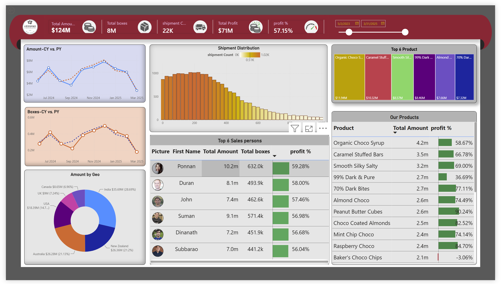

# Awesome Chocolates Sales & Profitability Dashboard

An end-to-end business intelligence dashboard built to analyze global sales performance, product profitability, and shipment distributions for a chocolate manufacturer.

## Dashboard Preview

## Key Performance Indicators (KPIs)
* **Total Revenue:** $124M
* **Total Volume:** 8M boxes sold
* **Total Shipments:** 22K
* **Total Profit:** $71M (57.15% overall profit margin)

## Key Insights & Features
* **Time Series Analysis:** Tracks Current Year (CY) versus Prior Year (PY) performance for both sales amounts and box volumes to identify seasonal trends.
* **Geographical Breakdown:** Visualizes revenue distribution across international markets, highlighting key regions such as India, New Zealand, Australia, and the USA.
* **Product Performance:** Highlights top-selling products and itemized profit margins, flagging underperforming lines like Baker's Choco Chips.
* **Sales Team Leaderboard:** Ranks top salespersons by total revenue, volume handled, and individual profit contributions.

## Tech Stack
* **Data Visualization:** Power BI (or Tableau)
* **Data Preparation:** SQL / Excel
* **Version Control:** Git & GitHub

## How to Use

Open the `.pbix` file in Power BI Desktop to interact with the filters and date slicers.
